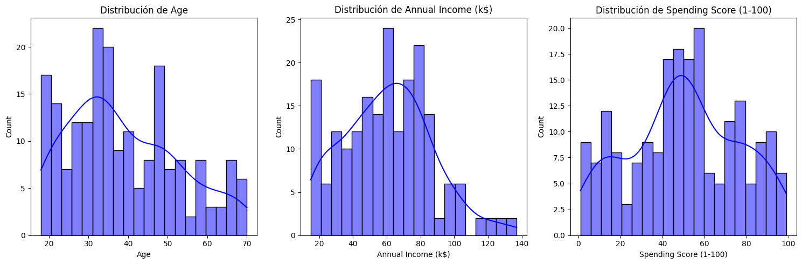
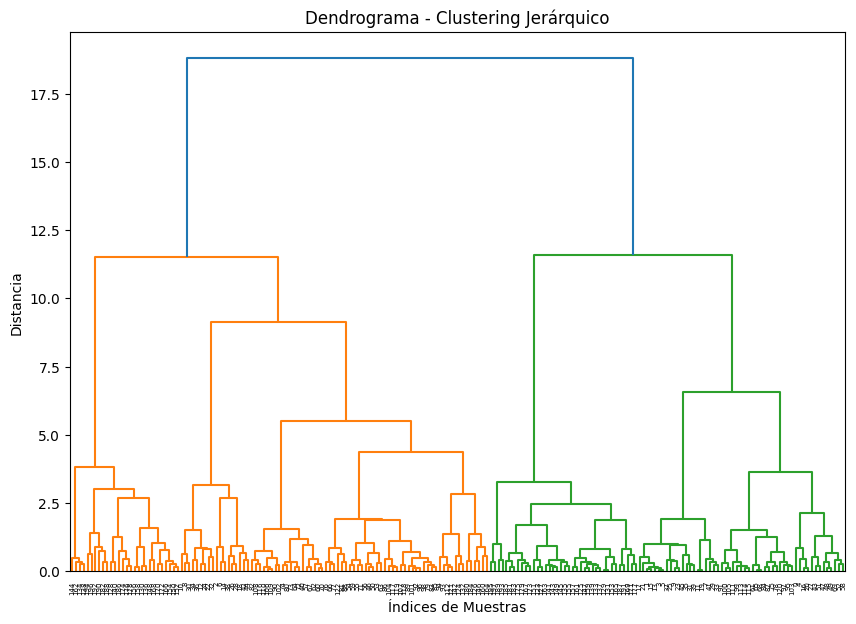

# Mall Customers Segmentation
## Dataset

Enlace: https://www.kaggle.com/datasets/abdallahwagih/mall-customers-segmentation

El conjunto de datos de clientes del centro comercial proporciona información sobre 200 individuos que visitan un centro comercial, incluyendo información demográfica, ingresos anuales y hábitos de gasto.
Se utilizará algoritmos de clustering para segmentar los clientes en grupos basados en sus características demográficas y de gasto. De esta manera, el centro comercial podrá personalizar sus estrategias de marketing y publicidad para cada grupo de clientes. 
Los algoritmos de clustering que se utilizarán son K-means, Agglomerative Clustering, Gaussian Mixture Model (GMM), DBSCAN y Affinity Propagation.

### Características del dataset
* Filas: 200
* Columnas: 5
    * **CustomerID:** ID único asignado al cliente.
    * **Género:** El género del cliente.
    * **Edad:** La edad del cliente.
    * **Ingreso Anual (k$):** El ingreso anual del cliente en miles de dólares.
    * **Puntuación de Gasto (1-100):** La puntuación de gasto del cliente basada en su comportamiento y datos de compra.

### Distribución de variables

* **Edad:** Se observa que la mayor concentración está entre los 30 y 40 años, con un pico significativo alrededor de los 35 años.
* **Ingreso Anual:** Destaca una alta concentración en el rango de 20-25k, con otros picos menores en los rangos de 80-100k y 100-120k.
* **Puntaje de Gasto (1-100):** Se observa una distribución bimodal, con picos en los rangos de 10-20 y 15-20, indicando que hay tanto clientes que gastan poco como clientes que gastan mucho.

### Boxplot de variables

* **Boxplot para 'Edad':** La mayoría de los clientes parecen estar en sus 40s y 50s, como se evidencia por el grupo denso de puntos en ese rango de edad. También hay algunos valores atípicos en edades más jóvenes y mayores.

* **Boxplot para 'Ingreso Anual (k$)':** La mayor parte de los ingresos se encuentran en el rango de 20-80k, con algunos valores atípicos de altos ingresos por encima de los 100k.

* **Boxplot para 'Puntaje de Gasto (1-100)':** Hay una amplia dispersión en el comportamiento de gasto, con algunos clientes que son muy altos gastadores y otros que son muy ahorradores.

Se decidió eliminar los primeros 2 valores atípicos en la variable 'Ingreso Anual (k$)' para mejorar la clusterización.
| Genre   | Age | Annual Income (k$) | Spending Score (1-100) |
|---------|-----|---------------------|------------------------|
| Male    | 32  | 137                 | 18                     |
| Male    | 30  | 137                 | 83                     |
| Female  | 45  | 126                 | 28                     |
| Male    | 32  | 126                 | 74                     |
| Female  | 47  | 120                 | 16                     |

* **Número de filas originales:** 200  
* **Número de filas después de eliminar:** 198

### Visualización de variables

Podemos ver que la cantidad de clientes femeninos es significativamente mayor que la de clientes masculinos, estos datos indican que el centro comercial tiene una base de clientes predominantemente femenina. Se observa que el 56.6% de los clientes son mujeres, mientras que el 43.4% son hombres.

* Los puntajes de gasto van desde aproximadamente 10 hasta 90, lo que indica una amplia variación en el comportamiento de gasto de los clientes.
* No parece haber una correlación lineal fuerte entre el ingreso anual y el puntaje de gasto. Los puntos de datos se encuentran dispersos en la gráfica, lo que sugiere que estas dos variables no están fuertemente relacionadas.
* Si bien hay superposición, los clientes femeninos tienden a tener puntajes de gasto más altos en promedio en comparación con los clientes masculinos, en los diversos niveles de ingresos.

* Los clientes abarcan un amplio rango de edades, desde los 20 hasta los 70 años.
* Hay una notable superposición entre los datos de hombres y mujeres, pero también se pueden identificar algunas tendencias. Los clientes femeninos tienden a tener puntajes de gasto ligeramente más altos que los masculinos, especialmente en el rango de edad entre 30 y 50 años.
* No se observa una correlación lineal clara entre la edad y el puntaje de gasto. Los clientes de diferentes edades muestran una amplia dispersión en sus niveles de gasto.

* Los clientes abarcan un rango de edades desde los 20 hasta los 70 años, con una mayor concentración en los 40-50 años.
* Los ingresos anuales de los clientes van desde los 20k hasta los 120k, con una mayor concentración en los niveles intermedios de 40-80k.
* Los puntajes de gasto varían desde aproximadamente 10 hasta 90, indicando una gran diversidad en los niveles de gasto de los clientes.
* En general, los clientes femeninos tienden a tener puntajes de gasto más altos que los masculinos, especialmente en los niveles de ingresos medios y altos.
* Se pueden observar algunos grupos o "racimos" de clientes con características similares en términos de edad, ingresos y puntaje de gasto.

Se observa que no hay una correlación fuerte entre ninguna de las variables. Los colores predominantes son cercanos al blanco y celeste, lo que sugiere que las relaciones entre las variables son muy débiles.

Algunas observaciones son:
* El Género y la Edad tienen una correlación positiva moderada (0,07).
* El Género y el Ingreso Anual tienen una correlación positiva débil (0,02).
* El Género y la Puntuación de Gasto tienen una correlación negativa débil (-0,06).
* La Edad y el Ingreso Anual no tienen correlación (0,00).
* La Edad y la Puntuación de Gasto tienen una correlación negativa moderada (-0,33).
* El Ingreso Anual y la Puntuación de Gasto tienen una correlación positiva débil (0,01).

Por tanto, las variables que tienen una correlación más fuerte son la Edad y la Puntuación de Gasto, con una correlación negativa moderada de -0,33. las variables analizadas son en gran medida independientes entre sí, ya que no existe una relación clara o significativa entre el género, la edad, el ingreso anual y la puntuación de gasto.

## Clusterización
### Dataset Original
Dado que las variables no siguen una distribución normal, se decidió escalar los datos utilizando el método StandardScaler. Además se utilizó las variables 'Edad', 'Ingreso Anual (k$)' y 'Puntaje de Gasto (1-100)' para la clusterización.
#### K-means

| Clusters | Silhouette | Calinski-Harabasz | Davies-Bouldin | Inercia     |
|----------|------------|-------------------|----------------|-------------|
| 2        | 0.334070   | 106.179877        | 1.265536       | 385.280453  |
| 3        | 0.318774   | 95.159679         | 1.123456       | 300.607788  |
| 4        | 0.405723   | 124.837793        | 0.929916       | 202.697077  |
| 5        | 0.412085   | 124.112627        | 0.879375       | 166.280246  |
| 6        | 0.437316   | 138.225959        | 0.823786       | 129.140700  |
| 7        | 0.412916   | 131.740092        | 0.918191       | 115.599462  |
| 8        | 0.412387   | 135.788881        | 0.862949       | 98.954674   |

##### Mejores resultados para cada métrica
* **Silhouette:** 0.437316 con `k=6` clusters.
* **Calinski-Harabasz:** 138.225959 con `k=6` clusters.
* **Davies-Bouldin:** 0.823786 con `k=6` clusters.

##### Método del codo

El método del codo sugiere que el número óptimo de clusters puede estar entre 4 y 6.

#### Agglomerative Clustering

| Clusters | Silhouette | Calinski-Harabasz | Davies-Bouldin |
|----------|------------|-------------------|----------------|
| 2        | 0.320484   | 99.220962         | 1.300519       |
| 3        | 0.339119   | 89.454739         | 1.063007       |
| 4        | 0.369125   | 100.773129        | 1.001621       |
| 5        | 0.400690   | 106.662348        | 0.929268       |
| 6        | 0.425948   | 124.891588        | 0.844619       |
| 7        | 0.415557   | 129.369861        | 0.827022       |
| 8        | 0.428048   | 128.274532        | 0.803267       |

##### Mejores resultados para cada métrica
* **Silhouette:** 0.428048 con `k=8` clusters.
* **Calinski-Harabasz:** 129.369861 con `k=7` clusters.
* **Davies-Bouldin:** 0.803267 con `k=8` clusters.

##### Dendrograma

Parecen haber alrededor de 6-8 segmentos principales de clientes en función de la estructura del dendrograma.

#### Gaussian Mixture Model (GMM)

| Clusters | Silhouette | Calinski-Harabasz | Davies-Bouldin |
|----------|------------|-------------------|----------------|
| 2        | 0.326157   | 103.457496        | 1.271407       |
| 3        | 0.297085   | 81.545076         | 1.062414       |
| 4        | 0.378367   | 108.031891        | 0.988640       |
| 5        | 0.378927   | 107.534877        | 0.872291       |
| 6        | 0.405264   | 116.085254        | 0.883334       |
| 7        | 0.405600   | 119.797616        | 0.871108       |
| 8        | 0.391781   | 124.365841        | 0.845886       |

##### Mejores resultados para cada métrica
* **Silhouette:** 0.405600 con `k=7` clusters.
* **Calinski-Harabasz:** 119.797616 con `k=7` clusters.
* **Davies-Bouldin:** 0.871108 con `k=7` clusters.

#### DBSCAN
| Parámetro      | Valores                          |
|----------------|----------------------------------|
| `eps` (radio de vecindad)  | 0.2, 0.5, 0.6, 0.7, 0.8, 1.0 |
| `min_samples`  | 3, 5, 10                         |

| Eps  | Min_Samples | Clusters | Silhouette  | Calinski-Harabasz | Davies-Bouldin |
|------|-------------|----------|-------------|-------------------|----------------|
| 0.2  | 3           | 11       | -0.326903   | 2.838314          | 1.611787       |
| 0.5  | 3           | 10       | 0.104705    | 18.589363         | 2.106148       |
| 0.6  | 3           | 3        | 0.174397    | 22.408497         | 3.697805       |
| 0.7  | 3           | 2        | 0.140744    | 3.735094          | 5.328080       |
| 0.8  | 3           | 1        | -1.000000   | -1.000000         | -1.000000      |
| 1.0  | 3           | 1        | -1.000000   | -1.000000         | -1.000000      |
| 0.2  | 5           | 1        | -1.000000   | -1.000000         | -1.000000      |
| 0.5  | 5           | 5        | 0.210434    | 39.525595         | 1.699401       |
| 0.6  | 5           | 2        | 0.189197    | 28.472502         | 2.725058       |
| 0.7  | 5           | 1        | -1.000000   | -1.000000         | -1.000000      |
| 0.8  | 5           | 1        | -1.000000   | -1.000000         | -1.000000      |
| 1.0  | 5           | 1        | -1.000000   | -1.000000         | -1.000000      |
| 0.2  | 10          | 0        | -1.000000   | -1.000000         | -1.000000      |
| 0.5  | 10          | 4        | 0.035817    | 20.280631         | 2.231584       |
| 0.6  | 10          | 4        | 0.285372    | 52.546040         | 1.423567       |
| 0.7  | 10          | 2        | 0.132057    | 20.273722         | 2.409862       |
| 0.8  | 10          | 1        | -1.000000   | -1.000000         | -1.000000      |
| 1.0  | 10          | 1        | -1.000000   | -1.000000         | -1.000000      |

##### Mejores resultados para cada métrica
* **Silhouette:** 0.285372 con `eps=0.6`, `min_samples=10` y `clusters=4`.
* **Calinski-Harabasz:** 52.546040 con `eps=0.6`, `min_samples=10` y `clusters=4`.
* **Davies-Bouldin:** 1.423567 con `eps=0.6`, `min_samples=10` y `clusters=4`.

##### Método de k-distancias

El método de k-distancias sugiere que el número óptimo de eps puede estar entre 0.6 y 0.8.

#### Affinity Propagation
| Damping Value | Preference Value | Affinity      |
|----------------|------------------|---------------|
| 0.5            | None             | euclidean     |
| 0.5            | -50              | euclidean     |
| 0.5            | -100             | euclidean     |
| 0.7            | None             | euclidean     |
| 0.7            | -50              | euclidean     |
| 0.7            | -100             | euclidean     |
| 0.9            | None             | euclidean     |
| 0.9            | -50              | euclidean     |
| 0.9            | -100             | euclidean     |

| Damping | Preference | Affinity  | Clusters | Silhouette | Calinski-Harabasz | Davies-Bouldin |
|---------|------------|-----------|----------|------------|-------------------|----------------|
| 0.5     | NaN        | euclidean | 13       | 0.364177   | 128.276761        | 0.955687       |
| 0.5     | -50.0      | euclidean | 4        | 0.404354   | 123.816043        | 0.941534       |
| 0.5     | -100.0     | euclidean | 3        | 0.335284   | 94.812302         | 1.104497       |
| 0.7     | NaN        | euclidean | 12       | 0.366839   | 131.307307        | 0.969319       |
| 0.7     | -50.0      | euclidean | 4        | 0.404354   | 123.816043        | 0.941534       |
| 0.7     | -100.0     | euclidean | 4        | 0.404354   | 123.816043        | 0.941534       |
| 0.9     | NaN        | euclidean | 12       | 0.366839   | 131.307307        | 0.969319       |
| 0.9     | -50.0      | euclidean | 4        | 0.404354   | 123.816043        | 0.941534       |
| 0.9     | -100.0     | euclidean | 3        | 0.336460   | 96.665855         | 0.994483       |

##### Mejores resultados para cada métrica
* **Silhouette:** 0.404354 con `damping=0.5`, `preference=-50.0`, `affinity=euclidean` y `clusters=4`.
* **Calinski-Harabasz:** 131.307307 con `damping=0.7`, `preference=None`, `affinity=euclidean` y `clusters=12`.
* **Davies-Bouldin:** 0.941534 con `damping=0.5`, `preference=-50.0`, `affinity=euclidean` y `clusters=4`.

### Dataset con Autoencoder
Debido al pequeño tamaño del dataset, se decidió utilizar un autoencoder para mejorar la clusterización. Se probó 3 Autoencoders:
| Tipo de Autoencoder       | Arquitectura de la Capa de Codificación | Arquitectura de la Capa de Decodificación | MSE   |
|---------------------------|----------------------------------------|------------------------------------------|-------|
| Complete Autoencoder       | Input: `input_dim` -> Dense(`input_dim`, ReLU) | Dense(`input_dim`, Linear)              | MSE: 0.009170 |
| Undercomplete Autoencoder  | Input: `input_dim` -> Dense(2, ReLU)   | Dense(`input_dim`, Linear)              | MSE: 0.235338 |
| Overcomplete Autoencoder   | Input: `input_dim` -> Dense(5, ReLU)   | Dense(`input_dim`, Linear)              | MSE: 0.001973 |

Se observa que el autoencoder overcomplete tiene el menor error cuadrático medio (MSE) de 0.001973, lo que indica que es el mejor modelo. Por lo tanto, se utilizará el autoencoder overcomplete que aumenta la dimensionalidad del dataset de 3 a 5 características.

#### K-means

| Clusters | Silhouette | Calinski-Harabasz | Davies-Bouldin | Inercia     |
|----------|------------|-------------------|----------------|-------------|
| 2        | 0.345263   | 118.817779        | 1.202041       | 299.566254  |
| 3        | 0.350316   | 102.880900        | 0.962150       | 234.123138  |
| 4        | 0.402069   | 126.397946        | 0.949026       | 162.853210  |
| 5        | 0.445360   | 141.434474        | 0.827355       | 122.394447  |
| 6        | 0.425550   | 127.782269        | 0.950521       | 111.184052  |
| 7        | 0.416575   | 141.779200        | 0.940336       | 88.226105   |
| 8        | 0.368620   | 132.913082        | 1.039591       | 81.598061   |

##### Mejores resultados para cada métrica
* **Silhouette:** 0.445360 con `k=5` clusters.
* **Calinski-Harabasz:** 141.434474 con `k=5` clusters.
* **Davies-Bouldin:** 0.827355 con `k=5` clusters.

##### Método del codo

El método del codo sugiere que el número óptimo de clusters es 5.

#### Agglomerative Clustering

| Clusters | Silhouette | Calinski-Harabasz | Davies-Bouldin |
|----------|------------|-------------------|----------------|
| 2        | 0.336127   | 113.954368        | 1.226695       |
| 3        | 0.348910   | 100.227388        | 0.956265       |
| 4        | 0.385783   | 117.394717        | 0.953289       |
| 5        | 0.424708   | 131.222855        | 0.845290       |
| 6        | 0.425392   | 133.092029        | 0.816922       |
| 7        | 0.400440   | 133.492336        | 0.868612       |
| 8        | 0.393094   | 130.118281        | 0.946442       |

##### Mejores resultados para cada métrica
* **Silhouette:** 0.425392 con `k=6` clusters.
* **Calinski-Harabasz:** 133.092029 con `k=6` clusters.
* **Davies-Bouldin:** 0.816922 con `k=6` clusters.

##### Dendrograma

Parecen haber alrededor de 6 a 8 segmentos principales de clientes en función de la estructura del dendrograma.

#### Gaussian Mixture Model (GMM)

| Clusters | Silhouette | Calinski-Harabasz | Davies-Bouldin |
|----------|------------|-------------------|----------------|
| 2        | 0.279981   | 79.084718         | 1.316289       |
| 3        | 0.143324   | 48.989107         | 1.709465       |
| 4        | 0.094420   | 34.888145         | 1.489289       |
| 5        | 0.063660   | 33.615319         | 1.413002       |
| 6        | 0.083484   | 35.542873         | 1.320799       |
| 7        | 0.213722   | 54.762123         | 1.460061       |
| 8        | 0.219733   | 62.634740         | 1.353064       |

##### Mejores resultados para cada métrica
* **Silhouette:** 0.279981 con `k=2` clusters.
* **Calinski-Harabasz:** 79.084718 con `k=2` clusters.
* **Davies-Bouldin:** 1.316289 con `k=2` clusters.

#### DBSCAN
| Parámetro        | Valores                              |
|------------------|--------------------------------------|
| `eps` (radio de vecindad)  | 0.2, 0.5, 0.6, 0.7, 0.8, 1.0   |
| `min_samples`    | 3, 5, 10                             |

| Eps  | Min_Samples | Clusters | Silhouette | Calinski-Harabasz | Davies-Bouldin |
|------|-------------|----------|------------|-------------------|----------------|
| 0.2  | 3           | 13       | -0.247055  | 3.375962          | 2.085244       |
| 0.5  | 3           | 8        | 0.120178   | 23.005925         | 2.047622       |
| 0.6  | 3           | 3        | 0.157807   | 22.346669         | 2.241010       |
| 0.7  | 3           | 1        | -1.000000  | -1.000000         | -1.000000      |
| 0.8  | 3           | 1        | -1.000000  | -1.000000         | -1.000000      |
| 1.0  | 3           | 1        | -1.000000  | -1.000000         | -1.000000      |
| 0.2  | 5           | 3        | -0.347479  | 5.120283          | 1.830757       |
| 0.5  | 5           | 4        | 0.077638   | 31.776209         | 2.023227       |
| 0.6  | 5           | 4        | 0.217409   | 39.114526         | 1.961860       |
| 0.7  | 5           | 1        | -1.000000  | -1.000000         | -1.000000      |
| 0.8  | 5           | 1        | -1.000000  | -1.000000         | -1.000000      |
| 1.0  | 5           | 1        | -1.000000  | -1.000000         | -1.000000      |
| 0.2  | 10          | 0        | -1.000000  | -1.000000         | -1.000000      |
| 0.5  | 10          | 4        | 0.289699   | 53.798595         | 1.234629       |
| 0.6  | 10          | 4        | 0.214990   | 46.254210         | 1.701117       |
| 0.7  | 10          | 2        | 0.274526   | 45.341667         | 1.674631       |
| 0.8  | 10          | 2        | 0.198230   | 12.632827         | 1.787523       |
| 1.0  | 10          | 1        | -1.000000  | -1.000000         | -1.000000      |

##### Mejores resultados para cada métrica
* **Silhouette:** 0.289699 con `eps=0.5`, `min_samples=10` y `clusters=4`.
* **Calinski-Harabasz:** 53.798595 con `eps=0.5`, `min_samples=10` y `clusters=4`.
* **Davies-Bouldin:** 1.234629 con `eps=0.5`, `min_samples=10` y `clusters=4`.

##### Método de k-distancias

El método de k-distancias sugiere que el número óptimo de eps puede estar en 0.7.

#### Affinity Propagation
| Damping Value | Preference Value | Affinity      |
|----------------|------------------|---------------|
| 0.5            | None             | euclidean     |
| 0.5            | -50              | euclidean     |
| 0.5            | -100             | euclidean     |
| 0.7            | None             | euclidean     |
| 0.7            | -50              | euclidean     |
| 0.7            | -100             | euclidean     |
| 0.9            | None             | euclidean     |
| 0.9            | -50              | euclidean     |
| 0.9            | -100             | euclidean     |

| Damping | Preference | Affinity  | Clusters | Silhouette | Calinski-Harabasz | Davies-Bouldin |
|---------|------------|-----------|----------|------------|-------------------|----------------|
| 0.5     | NaN        | euclidean | 13       | 0.335479   | 124.898865        | 1.053613       |
| 0.5     | -50.0      | euclidean | 5        | 0.412427   | 129.190370        | 0.865574       |
| 0.5     | -100.0     | euclidean | 3        | 0.293564   | 86.069876         | 1.334749       |
| 0.7     | NaN        | euclidean | 11       | 0.367132   | 130.984726        | 1.039013       |
| 0.7     | -50.0      | euclidean | 5        | 0.424915   | 136.562289        | 0.863096       |
| 0.7     | -100.0     | euclidean | 3        | 0.340925   | 104.843038        | 1.129599       |
| 0.9     | NaN        | euclidean | 11       | 0.367806   | 131.338520        | 1.025798       |
| 0.9     | -50.0      | euclidean | 4        | 0.401855   | 125.191394        | 0.963506       |
| 0.9     | -100.0     | euclidean | 2        | 0.340950   | 116.735288        | 1.204345       |

##### Mejores resultados para cada métrica
* **Silhouette:** 0.424915 con `damping=0.7`, `preference=-50.0`, `affinity=euclidean` y `clusters=5`.
* **Calinski-Harabasz:** 136.562289 con `damping=0.7`, `preference=-50.0`, `affinity=euclidean` y `clusters=5`.
* **Davies-Bouldin:** 0.863096 con `damping=0.7`, `preference=-50.0`, `affinity=euclidean` y `clusters=5`.

### Mejores Resultados para cada método de clusterización	

| **Técnica**                  | **Dataset**           | **Métrica**            | **Valor**       | **Configuración**                                      |
|------------------------------|-----------------------|------------------------|-----------------|------------------------------------------------------|
| **K-means**                  | Original             | Silhouette             | 0.437316        | `k=6` clusters                                       |
|                              |                      | Calinski-Harabasz      | 138.225959      | `k=6` clusters                                       |
|                              |                      | Davies-Bouldin         | 0.823786        | `k=6` clusters                                       |
|                              | Autoencoder          | Silhouette             | 0.445360        | `k=5` clusters                                       |
|                              |                      | Calinski-Harabasz      | 141.434474      | `k=5` clusters                                       |
|                              |                      | Davies-Bouldin         | 0.827355        | `k=5` clusters                                       |
| **Agglomerative Clustering** | Original             | Silhouette             | 0.428048        | `k=8` clusters                                       |
|                              |                      | Calinski-Harabasz      | 129.369861      | `k=7` clusters                                       |
|                              |                      | Davies-Bouldin         | 0.803267        | `k=8` clusters                                       |
|                              | Autoencoder          | Silhouette             | 0.425392        | `k=6` clusters                                       |
|                              |                      | Calinski-Harabasz      | 133.092029      | `k=6` clusters                                       |
|                              |                      | Davies-Bouldin         | 0.816922        | `k=6` clusters                                       |
| **Gaussian Mixture Model**   | Original             | Silhouette             | 0.405600        | `k=7` clusters                                       |
|                              |                      | Calinski-Harabasz      | 119.797616      | `k=7` clusters                                       |
|                              |                      | Davies-Bouldin         | 0.871108        | `k=7` clusters                                       |
|                              | Autoencoder          | Silhouette             | 0.279981        | `k=2` clusters                                       |
|                              |                      | Calinski-Harabasz      | 79.084718       | `k=2` clusters                                       |
|                              |                      | Davies-Bouldin         | 1.316289        | `k=2` clusters                                       |
| **DBSCAN**                   | Original             | Silhouette             | 0.285372        | `eps=0.6`, `min_samples=10`, `clusters=4`           |
|                              |                      | Calinski-Harabasz      | 52.546040       | `eps=0.6`, `min_samples=10`, `clusters=4`           |
|                              |                      | Davies-Bouldin         | 1.423567        | `eps=0.6`, `min_samples=10`, `clusters=4`           |
|                              | Autoencoder          | Silhouette             | 0.289699        | `eps=0.5`, `min_samples=10`, `clusters=4`           |
|                              |                      | Calinski-Harabasz      | 53.798595       | `eps=0.5`, `min_samples=10`, `clusters=4`           |
|                              |                      | Davies-Bouldin         | 1.234629        | `eps=0.5`, `min_samples=10`, `clusters=4`           |
| **Affinity Propagation**     | Original             | Silhouette             | 0.404354        | `damping=0.5`, `preference=-50.0`, `clusters=4`     |
|                              |                      | Calinski-Harabasz      | 131.307307      | `damping=0.7`, `preference=None`, `clusters=12`     |
|                              |                      | Davies-Bouldin         | 0.941534        | `damping=0.5`, `preference=-50.0`, `clusters=4`     |
|                              | Autoencoder          | Silhouette             | 0.424915        | `damping=0.7`, `preference=-50.0`, `clusters=5`     |
|                              |                      | Calinski-Harabasz      | 136.562289      | `damping=0.7`, `preference=-50.0`, `clusters=5`     |
|                              |                      | Davies-Bouldin         | 0.863096        | `damping=0.7`, `preference=-50.0`, `clusters=5`     |

### Mejores resultados globales por métrica y algoritmo

| **Técnica**                  | **Métrica**          | **Valor**       | **Configuración**                                      |
|------------------------------|----------------------|-----------------|------------------------------------------------------|
| **K-means**                  | Silhouette          | 0.445360        | Dataset Autoencoder, `k=5` clusters                 |
|                              | Calinski-Harabasz   | 141.434474      | Dataset Autoencoder, `k=5` clusters                 |
|                              | Davies-Bouldin      | 0.823786        | Dataset Original, `k=6` clusters                    |
| **Agglomerative Clustering** | Silhouette          | 0.428048        | Dataset Original, `k=8` clusters                    |
|                              | Calinski-Harabasz   | 133.092029      | Dataset Autoencoder, `k=6` clusters                 |
|                              | Davies-Bouldin      | 0.803267        | Dataset Original, `k=8` clusters                    |
| **Gaussian Mixture Model**   | Silhouette          | 0.405600        | Dataset Original, `k=7` clusters                    |
|                              | Calinski-Harabasz   | 119.797616      | Dataset Original, `k=7` clusters                    |
|                              | Davies-Bouldin      | 0.871108        | Dataset Original, `k=7` clusters                    |
| **DBSCAN**                   | Silhouette          | 0.289699        | Dataset Autoencoder, `eps=0.5`, `min_samples=10`, `clusters=4` |
|                              | Calinski-Harabasz   | 53.798595       | Dataset Autoencoder, `eps=0.5`, `min_samples=10`, `clusters=4` |
|                              | Davies-Bouldin      | 1.234629        | Dataset Autoencoder, `eps=0.5`, `min_samples=10`, `clusters=4` |
| **Affinity Propagation**     | Silhouette          | 0.424915        | Dataset Autoencoder, `damping=0.7`, `preference=-50.0`, `clusters=5` |
|                              | Calinski-Harabasz   | 136.562289      | Dataset Autoencoder, `damping=0.7`, `preference=-50.0`, `clusters=5` |
|                              | Davies-Bouldin      | 0.863096        | Dataset Autoencoder, `damping=0.7`, `preference=-50.0`, `clusters=5` |

## Conclusiones sobre los resultados de clusterización

### 1. Rendimiento general de los métodos
- **K-means** es el método más consistente, alcanzando los mejores valores en las dos métricas principales (Silhouette y Calinski-Harabasz). Esto indica su capacidad para formar clusters bien definidos.
- **Agglomerative Clustering** obtuvo resultados competitivos, especialmente en la métrica Davies-Bouldin, con un valor óptimo de 0.803267 en el dataset original.
- Los métodos **Gaussian Mixture Model (GMM)**, **DBSCAN** y **Affinity Propagation** tuvieron un desempeño inferior en comparación, con valores más bajos en las métricas de calidad.

### 2. Impacto del dataset (Original vs. Autoencoder)
- El dataset transformado mediante **autoencoder** mejoró los resultados para **K-means**, logrando:
  - El mejor valor de **Silhouette** (0.445360).
  - El mejor valor de **Calinski-Harabasz** (141.434474).
  Esto sugiere que la reducción de dimensionalidad y extracción de características relevantes beneficia a los métodos de clusterización basados en centroides.
- Para **DBSCAN** y **Affinity Propagation**, se observó una leve mejora al usar el dataset autoencoder, aunque los valores absolutos siguen siendo bajos en comparación con **K-means**.
- **Agglomerative Clustering** mostró resultados mixtos, con un mejor desempeño en **Davies-Bouldin** al usar el dataset original.

### 3. Configuraciones óptimas
- **K-means** mostró su mejor desempeño con:
  - `k=5` para maximizar **Silhouette** y **Calinski-Harabasz**.
  - `k=6` para minimizar **Davies-Bouldin**.
- **Agglomerative Clustering** obtuvo su mejor resultado con `k=8` en el dataset original.
- **GMM** mostró su mejor configuración con `k=7` en el dataset original, aunque los resultados fueron inferiores a los de **K-means** y **Agglomerative Clustering**.
- **DBSCAN** y **Affinity Propagation** tuvieron mejores valores de **Silhouette** y **Davies-Bouldin** con configuraciones específicas:
  - DBSCAN: `eps=0.5`, `min_samples=10`.
  - Affinity Propagation: `damping=0.7`.

### 4. Número óptimo de clusters
- Basado en los resultados de las métricas de evaluación, el **número óptimo de clusters** varía según el método:
  - Para **K-means**, los resultados sugieren que **5 clusters** son óptimos en general, dado el equilibrio entre las métricas.
  - Para **Agglomerative Clustering**, los resultados sugieren entre **6 y 8 clusters**, dependiendo de la métrica priorizada.
  - Sin embargo, considerando el rendimiento general y la estabilidad de **K-means**, el número **5** se destaca como la opción más robusta y confiable.

### 5. Elección del método según métrica
- Para maximizar **Silhouette**, el mejor enfoque es **K-means** con el dataset autoencoder (`k=5`).
- Para maximizar **Calinski-Harabasz**, **K-means** también es superior, nuevamente con el dataset autoencoder (`k=5`).
- Para minimizar **Davies-Bouldin**, **Agglomerative Clustering** con el dataset original (`k=8`) es la mejor opción.

### 6. Recomendaciones generales
- El uso de un autoencoder para la transformación del dataset resulta beneficioso en la mayoría de los casos, especialmente para **K-means**.
- **K-means** y **Agglomerative Clustering** destacan como los métodos principales para datasets de estas características.
- Métodos como **DBSCAN** y **Affinity Propagation** podrían no ser ideales para este tipo de datos, dado que presentan menor cohesión en sus clusters según las métricas utilizadas.

### Conclusión final
**K-means con 5 clusters** es la configuración más robusta y recomendable para este análisis, especialmente con la ayuda de técnicas de reducción de dimensionalidad como autoencoders.

### Interpretación de los Clusters

1. **Cluster 1 (puntos turquesa)**:
   - **Características**: Clientes más jóvenes (aproximadamente entre 10 y 20 años), con ingresos anuales bajos, pero con altos niveles de gasto.
   - **Interpretación**: Estos clientes podrían estar en una etapa temprana de su vida profesional, pero tienen un comportamiento de compra que supera sus ingresos, lo que podría indicar que tienen un alto poder adquisitivo relativo, quizás debido a factores como el apoyo familiar.

2. **Cluster 2 (puntos amarillos)**:
   - **Características**: Clientes jóvenes (15-20 años) con ingresos anuales altos y puntajes de gasto altos.
   - **Interpretación**: Este grupo podría estar compuesto por jóvenes que ya tienen una fuente de ingresos significativa y, por lo tanto, tienen la capacidad de gastar en productos o servicios de alta gama. Es un grupo que combina juventud con un poder adquisitivo elevado.

3. **Cluster 3 (puntos morados)**:
   - **Características**: Clientes de mayor edad (entre 30 y 60 años), con ingresos anuales más altos, pero con puntajes de gasto bajos.
   - **Interpretación**: Este grupo refleja clientes que tienen una situación financiera estable debido a sus ingresos más altos, pero su comportamiento de gasto es más conservador. Pueden ser personas más responsables o enfocadas en el ahorro.

4. **Cluster 4 (puntos verdes)**:
   - **Características**: Clientes de edades variadas (entre 20 y 60 años), con ingresos medios a altos, pero puntajes de gasto bajos.
   - **Interpretación**: Este grupo parece estar formado por clientes con ingresos estables, pero que no gastan tanto. Esto podría deberse a un enfoque más moderado del consumo, o bien a una falta de interés por los productos que podrían ofrecerse.

5. **Cluster 5 (puntos azules)**:
   - **Características**: Clientes jóvenes (entre 15 y 25 años) con ingresos anuales altos y puntajes de gasto altos.
   - **Interpretación**: Al igual que el **Cluster 2**, este grupo está compuesto por jóvenes con alto poder adquisitivo, pero la diferencia puede ser que este cluster está más concentrado en el rango de edad 15-25 años. Este grupo podría incluir personas en sus primeros años de carrera profesional, pero con ingresos relativamente altos.

### Resumen:
- **Cluster 1**: Jóvenes con bajo ingreso, pero alto gasto.
- **Cluster 2**: Jóvenes con alto ingreso y alto gasto.
- **Cluster 3**: Adultos mayores con alto ingreso y bajo gasto.
- **Cluster 4**: Adultos con ingreso medio a alto y bajo gasto.
- **Cluster 5**: Jóvenes con alto ingreso y alto gasto.
